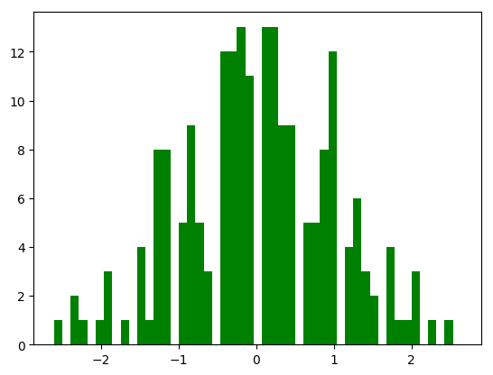

## Sample Text

I wish to show Python histogram (Fig. \@ref(fig:FirstHist)) in my .tex

```{python, echo=FALSE}
import numpy as np
import matplotlib.mlab as mlab
import matplotlib.pyplot as plt

w = np.random.randn(50, 4)
plt.hist(w, facecolor='green')

# Now I wish to include histogram in the generated document, so I've tried:
# plt.show()
# Unfortunately it shows shortly a window with histogram and waits until I close it.
# I think there's no such possibility, so I save it to file and then inserts in R code chunk:
plt.savefig('FirstHist.png', bbox_inches='tight')
```

```{r FirstHist, echo=FALSE, fig.align="center", out.width = ".8\\linewidth", fig.cap="Histogram of w"}

```

Zadałem pytanie na: http://stackoverflow.com/questions/42594662/r-markdown-with-chunks-in-both-python-and-r-is-there-possibility-to-use-shared


